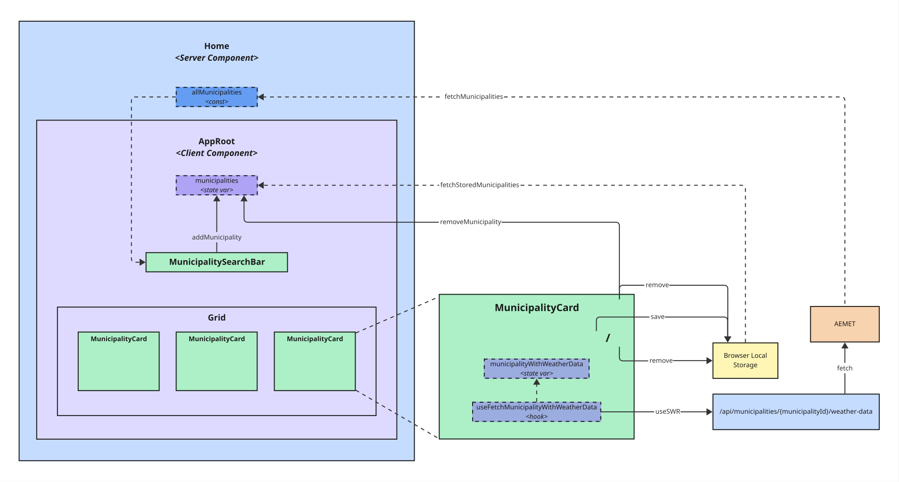

This is a simple single-page weather app made in Next.js and React.

## Table of Contents
1. [How it works](#how-it-works)
2. [Followed practices](#followed-practices)
3. [App Architecture](#app-architecture)
4. [Commands](#commands)
5. [Used technologies](#used-technologies)

# How it works

The intent of this app is purely academic; I created it to further practice my knowledge
in web front-end app development in React and Next.js. This weather app specifies a dropdown 
list that serves as a municipality search bar so that any user can pick one at a time. When 
she does it, a card showing several weather data (max, min, and current temperature, rain
probability, etc.) is displayed.

Cards include a save and a close button. When clicking on the save
button, some municipality identification data is stored at the local storage of the user's
browser, thus enabling the weather app to re-fetch the weather data of her favourite
municipalities whenever she comes back to the site where the app is hosted (unless she
manually deletes the browser local storage contents). Once saved, the user is also able to
discard the card from her favourite municipalities, thus deleting its related data from
the local storage.

The close button, on another hand, not only removes the card from the
view, but also deletes its related data from the local storage.

Last but not least, the weather app only works for Spanish municipalities, but I am pretty
sure that you are smart enough to update or even scale it to make it work with other
municipalities around the world ;-)

# Followed practices

I followed Test Driven-Development (TDD) to build this app. This means that before writing
any new feature, I first focused on building a test that I expected the code to pass
following the red-green-refactor loop. That
way, [paraphrasing Dave Farley](https://twitter.com/davefarley77/status/1640382698207297536),
I was able to work in small steps and getting really useful feedback on my endeavour.

On the topic of validation, it is also worth mentioning that I followed Kent C.Dodds'
[Testing Trophy](https://testingjavascript.com/) methodology to write the right (mostly
integration) tests to gain the required confidence on the validity of my code.

Another important point to mention is that single-page is not synonym of putting all the
code in one single file. Despite React is some fantastic library to build front-end
applications, we (developers) should follow standard patterns and techniques to modularise
our web apps, as mentioned by Juntao QIU
in [this inspiring article](https://martinfowler.com/articles/modularizing-react-apps.html).
So I did.

Finally, I also followed the [trunk-base development](https://trunkbaseddevelopment.com/)
methodology. Not to say that I needed
any other Git workflow for this project since I am the one and only developer of this app,
but I wanted to highlight the main benefit of this methodology: avoid the merge hell.
Besides, I truly believe that you do not need other branches when it comes to build an app
meant to provide users with new features (use feature toggles/flags if you are to
incorporate experimental ones).

# App Architecture

The app’s core flow is:
1. `src/app/page.tsx` is a server component (RSC). It fetches municipalities via a server-side function (`fetchMunicipalities`) and passes them as props to `AppRoot`.
2. `AppRoot` renders `MunicipalitySearchBar` with all municipalities and keeps selected municipalities in a client state (`municipalities`).
3. Selecting a municipality in the dropdown updates state in `AppRoot`, which re-renders and adds a new `MunicipalityCard`.
4. Each `MunicipalityCard` loads weather data using `useSWR` and a route handler at `src/app/api/municipalities/[municipality]/weather-data/route.ts` (currently calling AEMET).
5. The user can mark a municipality as favourite, which stores it in browser local storage, or unmark it to remove it from favourites.
6. Closing a card removes it from the grid and from local storage.

All user-initiated operations are marked by user actions (select municipality, mark/unmark favourite, close card). Component re-renders are intentionally not illustrated for clarity; they are implied by state updates.

Additionally, data fetching and transformation to domain objects are decoupled in `src/infrastructure`. This acts as an anti-corruption layer and makes it easy to change the upstream municipality provider without affecting component logic.

# Commands

- `pnpm dev` — Run the app locally in development mode (hot reload). Open `http://localhost:3000`.
- `pnpm start` — Start the production server after building, typically used after `pnpm build` in deployment.
- `pnpm test` — Run tests (Jest + React Testing Library) to validate behavior and regression safety.

# Used technologies

Here is a list of the most outstanding technologies that I used to implement this app:

- [Next.js](https://nextjs.org/) with React 18
- [Typescript](https://www.typescriptlang.org/)
- [MUI](https://mui.com/) component library
- [Custom MUI theme](https://mui.com/material-ui/customization/theming/)
  and React [useMediaQuery](https://mui.com/material-ui/react-use-media-query/) for
  responsive layouts
- [useSRW](https://swr.vercel.app/) to automatically fetch weather data updates
- [React Testing Library](https://testing-library.com/docs/react-testing-library/intro/)
  with [Jest](https://jestjs.io/) to validate the code
- [Husky](https://github.com/typicode/husky) to define both a pre-commit hook to TS
  compile and [prettify](https://prettier.io/) the code and a
  pre-push hook to run all the code tests before performing version control
- [Vercel](https://vercel.com/) as a deployment and hosting infrastructure
- CI/CD via [Github Actions](https://docs.github.com/en/actions)

